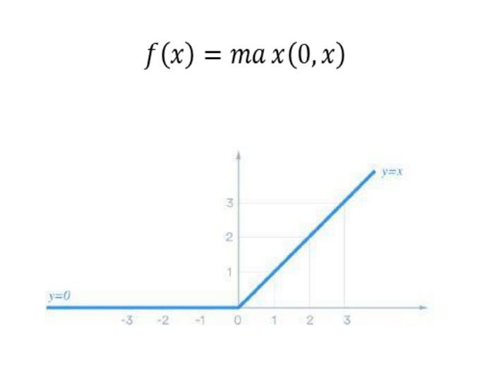

Son funciones que se usan en nuestro redes neoruales que permiten trabajar con  diferentes [[Tipos de problemas]]

Por lo que no se limitan solo a los típicos problemas de  lineales permitiendo resolver problemas mas complejos, ejemplo funcion ReLU:

Es un tipo de función que todo numero positivo graficado da ese mismo numero pero si es numero negativo siempre es 0:

