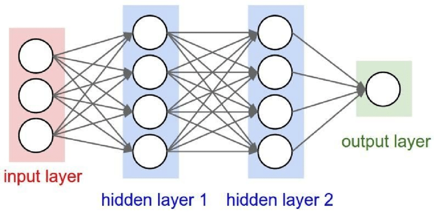
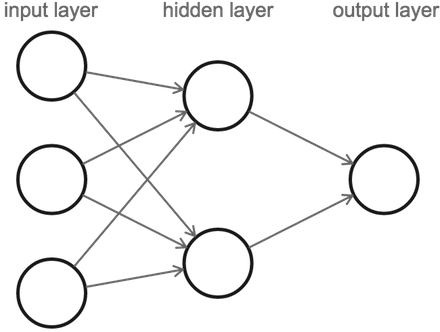

Son un nodo o unidad basica que cuenta con enrtadas y este devuelve un resultado dentro del mismo tenemos  un valor llamado sesgo que es comparado con los valores de entrada que cada uno tiene su peso(grado de importancia en el  modelo)

Tambien llamados Neuronas

Estas se puede relacionar con otras de dos formas

Red neoronal densa con 3 entradas y una salida

Red neuronal simple


Ejemplo de red neuronal simple:
```Python

import tensorflow as tf
import numpy as np

celsius = np.array([-40,-10,0,8,15,22,38],dtype=float)#datos en una 1 diemnsion para entrebnar red
fahrenheint = np.array([-40,14,32,46,59,72,100],dtype=float)

capa = tf.keras.layers.Dense(units=1,input_shape=[1])#capa densa de un nodo
modelo = tf.keras.Sequential([capa])#le pasamos la cpa como configuramos y de manera secuencial

modelo.compile(
    optimizer = tf.keras.optimizers.Adam(0.1),#capacidad de cambio de 0.1
    loss='mean_squared_error'#la perdida no debe ser mayor esta es la funcion de perdida
)

print("Comenzando")
historial = modelo.fit(celsius,fahrenheint,epochs=1000,verbose=False)#entrenamos modelo despues compilar
print("Entrenado")

import matplotlib.pyplot as plt
#lo vemos en grafica su entrenamiento
plt.xlabel('# Epoca')
plt.ylabel('Magnitud perdida')
plt.plot(historial.history["loss"])

print("Hagamos una prediccion!")
resultado = modelo.predict([100.0])#prueba
print("El resultado es " + str(resultado) + "fahreint")

print("Variables internas del modelo")
print(capa.get_weights())
```

Esto seria un ejemplo básico de una red nerounal basica  

Ahora si usamos mas capas generalmente hace el proceso de nrtenamiento mas rapido pero no necesariamente es siempre asi en ejemplo anteroior se calcula solo con los valores de fareheint y y celsius como ya lo sabemos que muetesre o saque su propio algoritmo para poedr calcularlo

